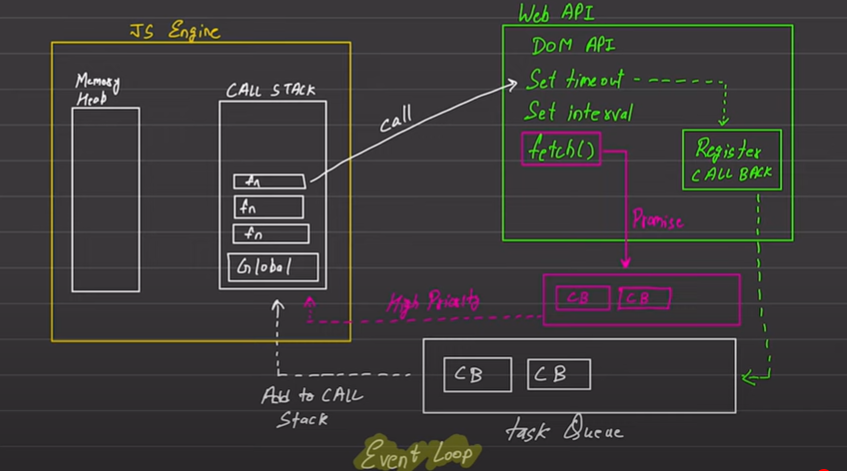

# Async JS

Default javascript is synchronous and single threaded.
Synchronous --> Excuting line by line
 
Single Threaded --> Run on single thread

| Blocking Code           | Non - Blocking Code      |
| ----------------------- | ------------------------ |
| Block flow of program   | Does't block executation |
| Read file synchronously | Read file asynchronously |
|                         |                          |

